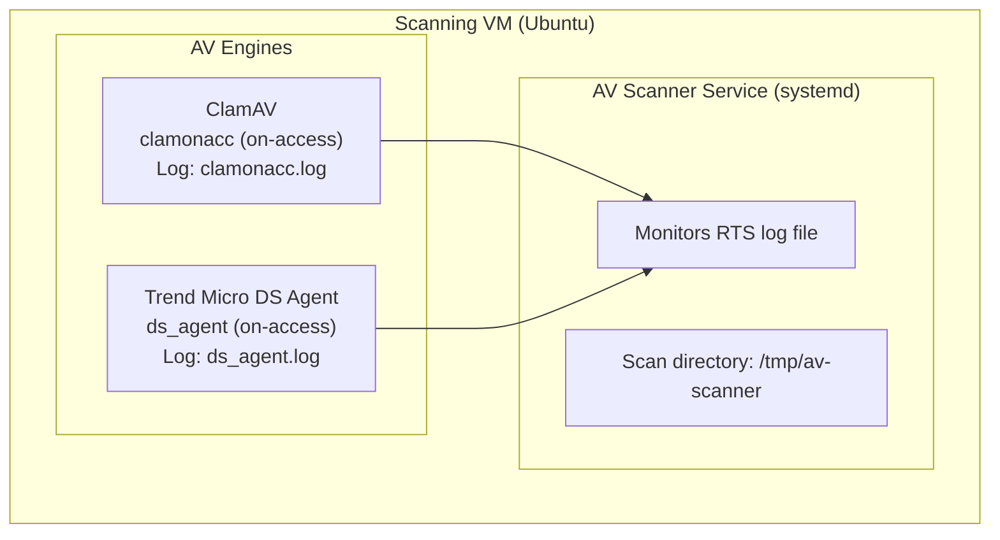

# AV Scanner - Antivirus Abstraction Layer

A unified antivirus scanning service that supports multiple AV engines (ClamAV and Trend Micro DS Agent) running on a **dedicated VM** with a consistent API.

## Architecture

Both ClamAV and Trend Micro DS Agent run on a **dedicated Ubuntu VM**. Both engines use **real-time scanning (RTS)** via log file monitoring:

| Component | ClamAV | Trend Micro DS Agent |
|-----------|--------|----------------------|
| **RTS Log File** | `/var/log/clamav/clamonacc.log` | `/var/log/ds_agent/ds_agent.log` |



## Features

- **Unified interface**: Both engines use the same pattern (RTS log file monitoring)
- **Isolated VM**: AV engines run in a dedicated Ubuntu VM
- **RTS-only architecture**: Monitors RTS log for real-time scan results
- **Ephemeral file handling**: Files are deleted immediately after scanning
- **Native systemd integration**: Runs as a native binary via systemd

## Quick Start

### 1. Install Prerequisites

```bash
# Install Multipass (Ubuntu/Debian)
sudo snap install multipass

# Install Ansible (in a virtualenv named 'venv' - required by Makefile)
python3 -m venv venv
source venv/bin/activate
pip install ansible
```

> **Note:** The `venv` directory must exist with Ansible installed. `make deploy` automatically activates it.

### 2. Create the Scanning VM

```bash
# Create Ubuntu VM with 2 CPUs, 2GB RAM, 10GB disk
multipass launch --name av-scanner --cpus 2 --memory 2G --disk 10G 24.04

# Verify VM is running
multipass list
```

### 3. Build and Deploy

```bash
# Get VM IP address
export AV_SCANNER_IP=$(multipass info av-scanner | grep IPv4 | awk '{print $2}')

# Copy your SSH key to the VM
multipass exec av-scanner -- bash -c "mkdir -p ~/.ssh && chmod 700 ~/.ssh"
cat ~/.ssh/id_rsa.pub | multipass exec av-scanner -- bash -c "cat >> ~/.ssh/authorized_keys && chmod 600 ~/.ssh/authorized_keys"

# Build the Docker image locally and deploy to VM
make deploy
```

The `make deploy` command will:
1. Build the Docker image locally (contains Go binary)
2. Save it to a tarball
3. Transfer the image to the VM via Ansible
4. Extract the binary from the image using Podman
5. Install the binary to `/usr/local/bin/av-scanner`
6. Create a systemd service
7. Start and enable the service
8. Wait for health check to pass

### 4. Access the Scanner API

```bash
# Get VM IP address
multipass info av-scanner | grep IPv4

# Test the API (from host)
curl http://<VM_IP>:3000/api/v1/health

# Scan a file
curl -X POST -F "file=@testfile.txt" http://<VM_IP>:3000/api/v1/scan
```

## Makefile Targets

| Target | Description |
|--------|-------------|
| `make build` | Build the Docker image locally |
| `make deploy` | Build, save, and deploy image to VM |
| `make test` | Upload EICAR test file to VM and verify detection |
| `make clean` | Remove local image and tarball |

## Service Management

The scanner runs as a native systemd service:

```bash
# SSH into VM
multipass shell av-scanner

# Check service status
sudo systemctl status av-scanner

# View logs
sudo journalctl -u av-scanner -f

# Restart service
sudo systemctl restart av-scanner

# Stop service
sudo systemctl stop av-scanner
```

## Multipass VM Management

```bash
# List VMs
multipass list

# Start/Stop VM
multipass start av-scanner
multipass stop av-scanner

# Shell into VM
multipass shell av-scanner

# Delete VM
multipass delete av-scanner
multipass purge
```

## Configuration

| Variable | Default | Description |
|----------|---------|-------------|
| `PORT` | 3000 | HTTP server port |
| `AV_ENGINE` | clamav | Active engine (clamav/trendmicro) |
| `UPLOAD_DIR` | /tmp/av-scanner | Shared scan directory |
| `MAX_FILE_SIZE` | 104857600 | Max upload size in bytes (100MB) |
| `LOG_LEVEL` | info | Log level |
| `CLAMAV_RTS_LOG_PATH` | /var/log/clamav/clamonacc.log | ClamAV RTS log file |
| `CLAMAV_TIMEOUT` | 15000 | ClamAV scan timeout in ms |
| `TM_RTS_LOG_PATH` | /var/log/ds_agent/ds_agent.log | DS Agent RTS log file |
| `TM_TIMEOUT` | 15000 | DS Agent scan timeout in ms |

To change configuration, edit the systemd service file on the VM:

```bash
sudo vi /etc/systemd/system/av-scanner.service
sudo systemctl daemon-reload
sudo systemctl restart av-scanner
```

## API

### POST /api/v1/scan
Upload and scan a file.

```bash
curl -X POST -F "file=@testfile.txt" http://<VM_IP>:3000/api/v1/scan
```

**Response:**
```json
{
  "fileId": "550e8400-e29b-41d4-a716-446655440000",
  "fileName": "testfile.txt",
  "status": "clean",
  "engine": "clamav",
  "signature": null,
  "duration": 150
}
```

### GET /api/v1/health
Health check for all engines.

### GET /api/v1/engines
List available engines.

### GET /api/v1/ready
Readiness probe (checks active engine health).

### GET /api/v1/live
Liveness probe.

## Testing with EICAR

```bash
# Run the EICAR test via Makefile
make test
```

Or manually:

```bash
# Download official EICAR test file
curl -s https://secure.eicar.org/eicar.com -o /tmp/eicar.com

# Test via API
curl -X POST -F "file=@/tmp/eicar.com" http://<VM_IP>:3000/api/v1/scan
# Expected response: status = "infected", signature = "Win.Test.EICAR_HDB-1"
```

## License

MIT
