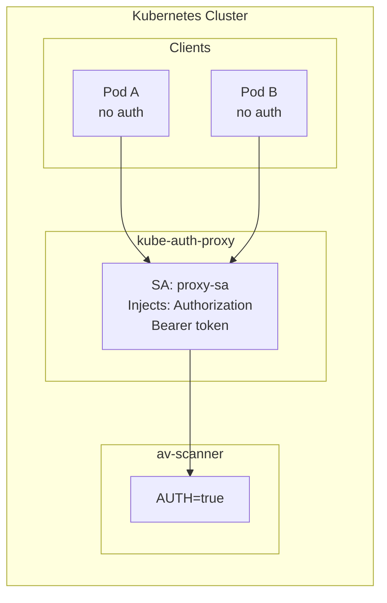

# kube-auth-proxy

A lightweight reverse proxy that authenticates to upstream services using its Kubernetes ServiceAccount token.

## Overview



## Purpose

- Clients call the proxy without authentication
- Proxy forwards requests to upstream, injecting its ServiceAccount token
- Upstream (av-scanner) only needs to allowlist the proxy's ServiceAccount
- Simplifies client code - no token handling required

## Configuration

| Environment Variable | Default | Description |
|---------------------|---------|-------------|
| `UPSTREAM_URL` | (required) | Upstream service URL (e.g., `http://av-scanner:3000`) |
| `LISTEN_ADDR` | `:8080` | Address to listen on |
| `TOKEN_PATH` | `/var/run/secrets/kubernetes.io/serviceaccount/token` | Path to ServiceAccount token |

## Build

```bash
# Build container image
make build

# Push to registry
make push

# Or with custom registry
REGISTRY=my-registry.io make push
```

## Deploy

```bash
# Deploy to Kubernetes
make deploy

# Remove from Kubernetes
make undeploy
```

## Kubernetes Manifests

The `k8s/` directory contains:

- `namespace.yaml` - Creates `auth-proxy` namespace
- `serviceaccount.yaml` - ServiceAccount for the proxy
- `deployment.yaml` - Proxy deployment
- `service.yaml` - ClusterIP service exposing port 8080
- `kustomization.yaml` - Kustomize configuration

## Usage

Once deployed, clients can call the proxy:

```bash
# From any pod in the cluster
curl http://kube-auth-proxy.auth-proxy:8080/api/v1/scan -F "file=@test.txt"
```

The proxy will forward to av-scanner with the Authorization header automatically added.

## av-scanner Configuration

Add the proxy's ServiceAccount to av-scanner's allowlist:

```yaml
# av-scanner allowlist.yaml
allowlist:
  - my-cluster/auth-proxy/kube-auth-proxy
```

## Security Considerations

- **Trust boundary**: All clients reaching the proxy are treated as the proxy's identity
- **Network policy**: Consider restricting which namespaces can reach the proxy
- **Single identity**: Upstream sees all requests as coming from the proxy ServiceAccount
